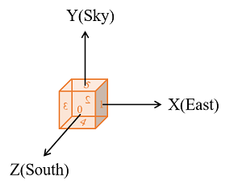

# Instructions and statements of MCRTlxx  
Executable files can only run on Ubuntu with CUDA, we have tested on different environments (graphics cards or CUDA).  
Different testing environments and running times(e.g. 6282_12clock.sh with 200 million rays) are:  
|Ubuntu kernal|Graphics Card|Driver Version|CUDA Version|Running time|
|:---|:---|:---|:---|:---|
|5.13|Nvidia GeForce RTX 3090|510.60|11.6| 0.075s|
|5.13|Nvidia GeForce RTX 3090|470.57|11.4| 0.08s|
|5.8|Nvidia GeForce RTX 3090|460.84|11.1| 0.13s|
|5.13|Nvidia GeForce RTX 1080ti|470.103|10.2| 0.25s|
|5.8|Nvidia GeForce RTX 1080|455.45|11.1| 0.38s|
|5.8|Nvidia GeForce RTX 1070|455.23|11.1| 0.40s|

## How to run  
After download files, need to grant permissions to MCRTlxx:
```
cd "current directory"
sudo chmod +777 MCRTlxx
```  
Run the exectuable file:
```
sh xxx.sh 
#xxx.sh is a script file, including input and output Settings
```   
You can design the input files according to your own needs, and then use MCRTlxx to simulate your heliostat field.

## How to design the inputfiles   
Inputfiles consist of two files, a json file for setting simulation parameters, a scn file for setting heliostat field and a txt file.
### Json file - configuration parameters
|Item|Meanings|
|:---|:---|
|sun_azimuth|Azimuth angle, 0 is point to North, closewise, 180 is point to South|
|sun_altitude|0 is point to ground, 90 is point to sky|
|csr|Parameter of Buie sunshape model|
|dni|Direct normal irradiance, $W/m^2$|
|num_of_sunshape_groups|The number of pre-generated random numbers is num_of_sunshape_groups*num_per_sunshape_group|
|num_per_sunshape_group|The number of rays generated on each microheliostat, num_per_sunshape_group*num_microheliostat is number of rays|
|inverse_transform_sampling_groups|Parameter of sampling Buie sunshape model by interpolation inverse sampling method|
|receiver_pixel_length|Pixel of receiver panel, the unit is $m$|
|glass_slope|slope error of glass layer which is assumed to obey Gaussian model, glass_slope is standard deviation|
|reflective_slope|slope error of reflective silver layer which is assumed to obey Gaussian model, glass_slope is standard deviation|
|helio_reflected_rate|The glass reflectivity of a heliostat|
|helio_pixel_length|Pixel of heliostat, determines the number of microheliostats|
### Scn file - heliostat field establishment parameters
#### Ground Boundary
|Item|Meanings|
|:---|:---|
|ground|M,N size of east to west and north to south, respectively|
|ngrid|Number of heliostat field, 1|  
  
#### Receiver attributes
|Item|Meanings|
|:---|:---|
|Recv|Type of receiver, 0 is rectangle, 1 is cylinder|
|pos|Position of center of receiver|
|size|Size of receiver, rectangle:  |
|norm|Normal direction of receiver panel cylinder(0,0,-1)|
|face|Rectangle: | 
  
#### Grid attributes
|Item|Meanings|
|:---|:---|
|Grid|Type of scene, only 0, others remain to be developed|
|pos|Position of southwest of the heliostat field|
|size|Length, width, thickness |
|inter|Interval of each grid: interX, interY, interZ, |
|n|Number of heliostats| 
|type|type of heliostats inside, only 0,  others remain to be developed|   
  
#### Heliostats
|Item|Meanings|
|:---|:---|
|gap|Interval of subheliostat, default: 0 0 |
|matrix|number of subheliostat, default: 1 1|
|helio|Pos: x,y,z.  Size: X-dir length, Y-dir length, Z-direction length| 


## Results  
Results are stored in a TXT file as a two-dimensional array.

## Statements  
If have problems running the program, please contact the author at linxxcad@zju.edu.cn. In addition, those who need the code can contact the author too, which can be given after qualification review and assessment.
